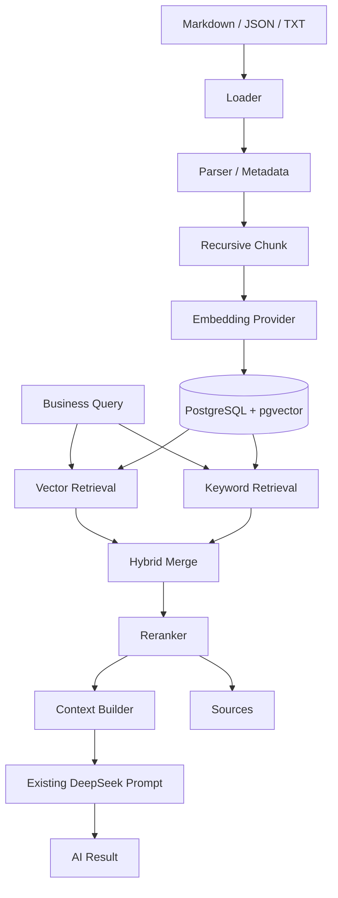

# PostgreSQL + pgvector + RAG 架构

> 更新日期：2026-09-24

## 1. 改造范围与现状问题

本次只升级知识库、Embedding、向量存储、检索和 RAG 调用链，不修改前端 UI，也不重写就业画像、岗位匹配、简历优化和成长规划的业务响应结构。

旧实现会在进程内读取 Markdown 并构建关键词索引，存在以下问题：知识内容随进程重复加载、无法进行语义召回、索引状态不可追踪、无法稳定增量更新，也不能提供可验证的来源追踪。

新实现保留 `knowledge/documents/` 中的 Markdown/JSON/TXT 原始资料，并通过幂等索引流程写入独立的 PostgreSQL 知识库。业务数据仍可使用原 SQLite/MySQL 数据库。

## 2. 总体流程



## 3. 为什么采用 PostgreSQL + pgvector

- PostgreSQL 同时保存文档元数据、索引状态、Chunk 和向量，便于事务管理、增量更新与统计。
- pgvector 提供原生 `vector(N)` 类型、Cosine Distance 查询和 HNSW 索引，不在 Python 中自行实现正式向量搜索。
- 项目只维护这一套正式向量存储；测试可以使用 Mock Embedding，但生产路径不使用内存向量库。

## 4. 模块结构

| 模块 | 职责 |
|---|---|
| `knowledge/loaders/` | 将 Markdown、JSON、TXT 统一为 `Document` |
| `knowledge/parsers/` | 清洗正文、解析 front matter、统一元数据 |
| `knowledge/chunking/` | 按标题、段落、句子递归切分并保留重叠 |
| `knowledge/embedding/` | Embedding 接口、Factory、SentenceTransformers 正式实现 |
| `knowledge/vector_store/` | 两张核心表及所有 PostgreSQL/pgvector 操作 |
| `knowledge/retrieval/` | Query Rewrite、HNSW、PostgreSQL FTS、RRF 和领域过滤 |
| `knowledge/reranker/` | 可替换 Reranker 接口与安全降级实现 |
| `knowledge/service/` | Context、Sources 和 RAG 编排 |
| `knowledge/pipeline/` | 文档哈希、Chunk、Embedding、增量 Upsert |

## 5. 数据库结构

### `knowledge_documents`

保存标题、唯一来源、分类、完整正文、JSON 元数据、内容哈希、索引状态、错误信息和索引时间。状态包含 `pending`、`processing`、`completed`、`failed`。

### `knowledge_chunks`

保存文档外键、Chunk 序号、正文、JSON 元数据、`vector(EMBEDDING_DIMENSION)`、Embedding 状态及错误信息。`document_id + chunk_index` 唯一，删除文档时级联删除 Chunk。

向量列使用 Cosine 运算类建立 HNSW 索引。查询结果把 Cosine Distance 转换为 `similarity = 1 - distance` 后返回。

## 6. Embedding 架构

`embedding/factory.py` 根据环境变量创建 Provider。正式默认值为：

```env
EMBEDDING_PROVIDER=sentence_transformers
EMBEDDING_MODEL=BAAI/bge-small-zh-v1.5
EMBEDDING_DIMENSION=512
```

模型名称与维度均可配置。每批结果都会校验维度；空文本、加载失败、推理失败和维度不匹配会明确报错。`MockEmbeddingProvider` 仅在 `APP_ENV=testing` 时允许由 Factory 创建。

## 7. Chunk 策略

默认 `CHUNK_SIZE=800`、`CHUNK_OVERLAP=120`。切分优先级依次考虑 Markdown 二/三级标题、段落、换行、中文句号/分号/逗号和空格，最后才按字符回退，尽量保持岗位要求、技能列表和段落结构完整。

## 8. Hybrid Retrieval、RRF 与 Reranker

向量检索负责自然语言语义召回；PostgreSQL FTS 负责 Vue、React、Python 等精确技能词和中文 n-gram。两路并行执行，结果按 Chunk ID 去重并使用可配置 `RRF_K` 的 Reciprocal Rank Fusion 融合。`VECTOR_WEIGHT` 和 `KEYWORD_WEIGHT` 仅保留为旧配置兼容项，不参与生产排序。

RRF 后的候选进入可配置 `CrossEncoderReranker`。默认关闭时使用 `NoOpReranker`；启用后由 `RERANKER_MODEL` 指定中文或多语言 Cross-Encoder。模型未缓存、加载失败或推理失败时记录错误并保持 RRF 顺序。

## 9. Context、Sources 与 DeepSeek

Context Builder 只拼接最终 Top-K，并受 `RAG_CONTEXT_MAX_CHARS` 限制。每段包含标题、分类、来源和内容。RAG 同时保留 `chunk_id`、`document_id`、标题、分类、分数和来源。

就业画像、岗位匹配 AI 精排、简历优化、成长规划以及三个 SSE 流式入口都会在原 Prompt 构造完成后尝试注入 RAG Context。知识库连接或检索失败时记录日志并继续使用原 Prompt，因而不会让这些既有 AI 业务直接返回 500。知识库管理/检索 API 自身会返回 HTTP 503 和错误码 `3101`。

## 10. 索引与增量更新

```text
源文件 -> Loader -> Document -> SHA-256 content_hash
     -> 未变化：跳过
     -> 新增/变化：Chunk -> Embedding -> Upsert PostgreSQL
     -> 失败：Document 标记 failed 并保存错误
```

同一 `source` 唯一。内容变化时删除旧 Chunk 后重新写入；重复运行 Seed 不会创建重复文档或 Chunk。可使用 `--force` 强制重建。

## 11. 部署与初始化

1. 将根目录 `.env.example` 和 `backend/.env.example` 中的知识库配置复制到实际环境文件。
2. 启动数据库：`docker compose up -d knowledge-db`。
3. 安装后端依赖：`py -m pip install -r backend/requirements.txt`。
4. 初始化全部现有知识：`py scripts/seed_knowledge.py`。
5. 启动后端后，通过 `GET /api/knowledge/stats` 和 `POST /api/knowledge/search` 验证。
6. 文档变化后再次运行 Seed 即为增量更新；强制重建使用 `py scripts/seed_knowledge.py --force`。
7. 如果需要同步删除已经从磁盘移除的源文件，使用 `py scripts/seed_knowledge.py --prune-missing`；该操作默认关闭，避免对指定子目录做误删除。

首次运行 SentenceTransformers 模型需要可访问模型来源并会产生本地模型缓存。生产环境应预先缓存模型，且 `EMBEDDING_DIMENSION` 必须与所选模型实际输出一致。

## 12. API

- `GET /api/knowledge`
- `POST /api/knowledge/search`
- `POST /api/knowledge/search/debug`
- `GET /api/knowledge/health`
- `GET /api/knowledge/documents/{id}`
- `POST /api/knowledge/documents`
- `DELETE /api/knowledge/documents/{id}`
- `POST /api/knowledge/documents/{id}/index`
- `POST /api/knowledge/reindex`
- `GET /api/knowledge/stats`

搜索示例：

```json
{
  "query": "前端开发工程师需要掌握什么技能",
  "top_k": 5,
  "category": "job"
}
```

`job`、`skill`、`growth` 等单数业务分类会映射到现有资料目录中的 `jobs`、`skills`、`roadmap`，避免迁移时改变原始文件目录。

离线检索质量回归指标位于 `knowledge/evaluation/metrics.py`，提供 Recall@K、MRR 和 NDCG@K。当前回归集位于 `knowledge/evaluation/test_cases.json`，用于记录答辩演示和后续真实数据库评测的标准问题。

## 13. 验收检查

- PostgreSQL 容器健康，`vector` 扩展存在。
- 两张知识表与 HNSW 索引创建成功。
- Seed 文档数与原始知识文件相符，重复 Seed 不增加重复记录。
- `embedded_count == chunks_count`，`failed_count == 0`。
- 向量、关键词、Hybrid、Context 和 Sources 测试通过。
- 四项 AI 业务在知识库可用时注入上下文，在知识库不可用时保持原响应契约并安全降级。
