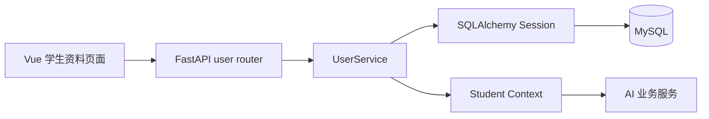

# 技术设计规范：学生资料与数据持久化基础

> **设计粒度：** High Level Design
> **版本：** v1.0
> **状态：** 已批准
> **最后更新：** 2026-07-23

## 1. 设计概述

本设计把现有 FastAPI 空壳变为可供前端和 AI 模块共同使用的学生资料数据服务。系统接收并持久化学生的基本资料、技能和项目经历，并向后续的就业画像、岗位匹配、简历优化和成长规划模块提供统一的用户上下文。

本阶段先建立可联调的数据基础，不包含登录鉴权、DeepSeek 调用或 AI 结果生成。这些能力由后续任务和另一位后端成员在既定数据契约上扩展。

## 2. 设计起点与约束

### 2.1 已知设计输入

- 后端固定采用 Python 3.10+、FastAPI、SQLAlchemy 2.0、Pydantic v2、PyMySQL 与 MySQL。
- 现有分层约束为 `API -> Service -> Model/Database`；请求和响应必须使用 Pydantic Schema。
- 现有前端默认通过 `/api` 调用后端，且架构文档定义统一响应格式为 `code`、`message`、`data`。
- 后续 AI 功能需要稳定的学生资料、技能、项目经历和聚合上下文作为输入。

### 2.2 强约束

- 数据库 URL、数据库密码和未来 DeepSeek API Key 只能通过环境变量读取，禁止写入源码。
- 所有写入操作必须在 Service 层完成，并在异常时回滚事务。
- API 层不得直接操作 SQLAlchemy Model；数据库错误不得直接暴露给客户端。
- 本阶段采用同步 SQLAlchemy Session，与现有 PyMySQL 依赖保持一致。

### 2.3 假设

- 首版 Demo 使用 MySQL 8.0；本地自动化测试允许使用 SQLite 作为替代数据库。
- 账号注册、密码和 JWT 鉴权不在本阶段实现。前端在 Demo 中先保存并持有 `user_id`。
- 技能等级限定为 `了解`、`熟悉`、`掌握`、`精通`；项目技术栈以 JSON 数组保存。
- 学校、专业和年级属于用户资料；独立教育经历表留待后续扩展。

## 3. 目标系统边界

### 3.1 涉及组件

| 组件 / 模块 | 作用 | 是否变更 |
|:---|:---|:---|
| `backend/main.py` | 初始化应用、注册路由、异常处理 | 是 |
| `app/database/` | 数据库引擎、Base、Session 依赖 | 是 |
| `app/models/user.py` | 用户、技能、项目经历的 ORM 模型 | 是 |
| `app/schemas/user.py` | 请求和响应校验模型 | 是 |
| `app/services/user_service.py` | 用户资料、技能、项目经历业务逻辑 | 是 |
| `app/api/user.py` | 用户资料 REST API | 是 |
| `app/utils/` | 统一响应和业务异常 | 是 |
| `backend/.env.example` | 非敏感环境变量模板 | 是 |
| `app/ai/`、`app/knowledge/` | AI 与知识库实现 | 否 |

### 3.2 明确不在范围内

- 用户注册、登录、密码散列、JWT 与权限控制。
- DeepSeek API 调用、Prompt、就业画像生成、岗位评分、简历优化和成长规划生成。
- 岗位知识库数据维护，以及 AI 结果表的最终字段设计。
- 前端页面、前端 API 封装和 Vite 代理配置。

## 4. 方案设计

### 4.1 总体方案

新增 `users`、`user_skills`、`user_projects` 三张表。用户资料是聚合根；技能和项目经历通过外键关联用户，更新技能或项目时采用整组替换，保证前端表单提交后的数据状态明确。

`UserService` 是唯一的数据库业务入口。它通过 `get_user_context` 返回可直接供 AI 业务模块使用的结构化上下文，AI 成员不得绕过 Service 层查询数据库。

### 4.2 调用链



### 4.3 关键接口与数据流

| 接口 / 数据流 | 输入 | 输出 | 约束 |
|:---|:---|:---|:---|
| `POST /api/users` | 姓名、学校、专业、年级、个人简介 | 新建用户资料与 `user_id` | 仅创建资料，不创建登录凭证 |
| `GET /api/users/{user_id}` | 用户 ID | 用户资料、技能、项目经历 | 用户不存在返回统一 404 业务错误 |
| `PUT /api/users/{user_id}` | 可修改的基本资料 | 更新后的用户资料 | 仅更新提供字段 |
| `PUT /api/users/{user_id}/skills` | 技能列表 | 当前完整技能列表 | 单事务整组替换 |
| `PUT /api/users/{user_id}/projects` | 项目列表 | 当前完整项目列表 | 单事务整组替换 |
| `GET /api/users/{user_id}/context` | 用户 ID | AI 可消费的聚合上下文 | 不包含密码或敏感凭证 |

所有成功响应为：

```json
{"code": 0, "message": "success", "data": {}}
```

### 4.4 数据模型

| 表 | 关键字段 | 关系与约束 |
|:---|:---|:---|
| `users` | `id`、`name`、`school`、`major`、`grade`、`bio`、时间戳 | 一对多关联技能和项目 |
| `user_skills` | `id`、`user_id`、`name`、`proficiency`、`description` | `user_id` 外键，删除用户时级联删除 |
| `user_projects` | `id`、`user_id`、`name`、`role`、`description`、`tech_stack`、开始/结束日期 | `tech_stack` 为 JSON 数组；`user_id` 级联删除 |

## 5. 备选方案与取舍

| 方案 | 结论 | 原因 |
|:---|:---|:---|
| 同步 SQLAlchemy + PyMySQL | 采用 | 与现有依赖一致，Demo 阶段实现和调试成本低 |
| 异步 SQLAlchemy + asyncmy | 放弃 | 需要替换数据库驱动并提高并发设计复杂度，当前无必要 |
| AI 服务直接查询 Model | 放弃 | 会破坏现有分层，且不利于后续数据结构调整 |
| 单独教育经历表 | 延后 | 首版仅需学校、专业和年级，避免扩大首阶段范围 |

## 6. 风险与验证策略

### 6.1 主要风险

- MySQL 未启动或环境变量缺失会导致服务无法连接数据库。
- AI 成员若在未对齐上下文结构前开发，会产生字段不兼容。
- 整组替换技能或项目时，部分写入失败可能造成数据不一致。

### 6.2 验证策略

- 提供 `.env.example` 和启动说明，启动时对必需数据库配置给出明确错误。
- 以 `GET /context` 的 JSON 为双方唯一数据契约；AI 成员使用其固定字段开发。
- 使用 API 测试验证创建、读取、更新、整组替换、缺失用户和事务回滚路径。

## 7. 派生需求提示

- 本设计派生出用户资料、技能、项目经历 CRUD 与 AI 上下文聚合能力。
- 本设计不派生出认证、AI 生成、岗位知识库检索或前端 UI 能力。

## 8. 审批记录

| 日期 | 审批人 | 决定 | 备注 |
|:---|:---|:---|:---|
| 2026-07-23 | 项目负责人 | 批准 | 用户批准启动执行 |
